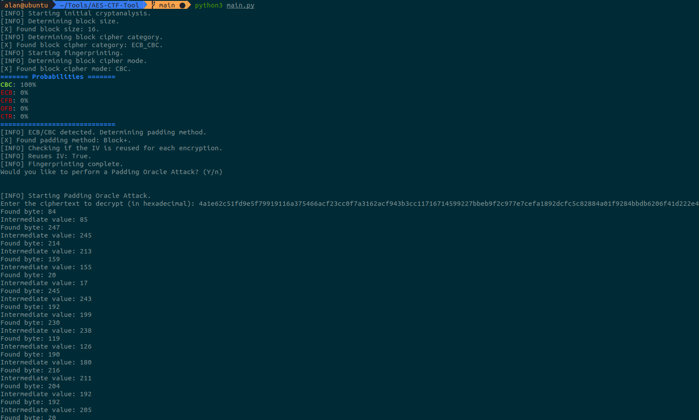

# AES CTF Tool V2
This challenge was exactly like the previous one but with a small change. 
To find the flag in fact you had to connect with netcat to the service and then submit the encoded flag to the tool wich then could decrypt it.  
This is another example of how I solved it: 
