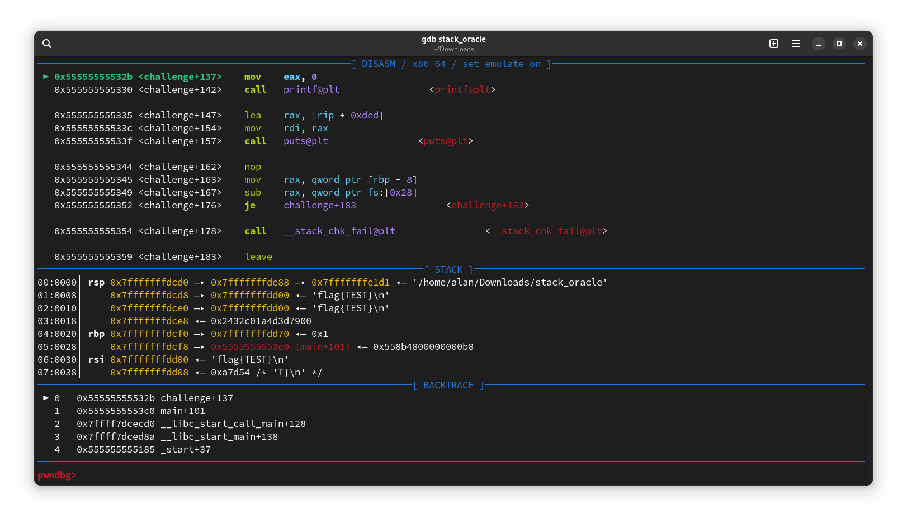

# Memory Wizard
Memory Wizard has attached a `64-bit x86-64 ELF` binary that requests an address from which to read data and then prints it to the standard output.

Analyzing the executable, it can be observed that both variables are declared on the stack with an 8-byte difference. Therefore, by using the leaked stack address, the flag address can be calculated like this `0xADDRESS + 8 = 0xFLAGADDRESS`.

### Challenge Description
>You never know who you get to encounter along the way... but you can still predict it.