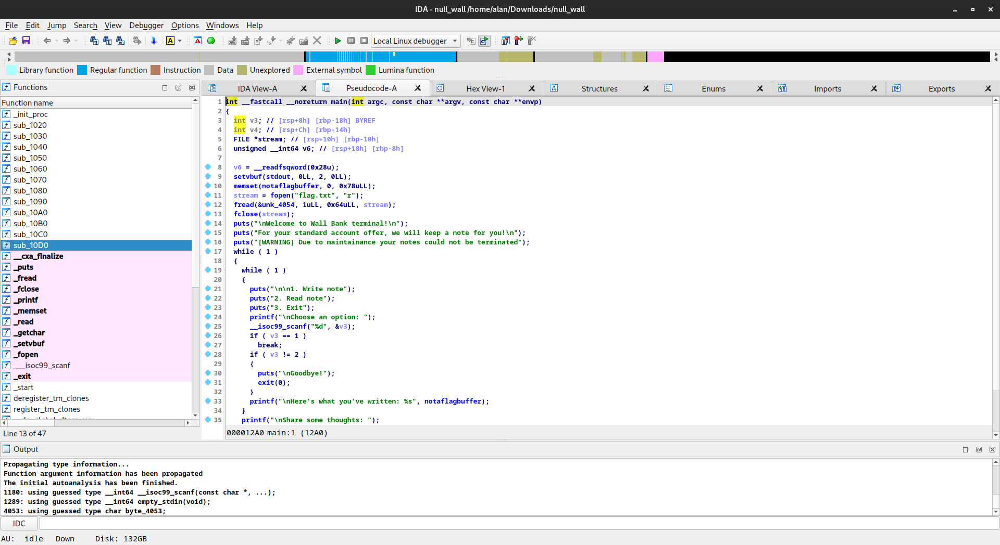
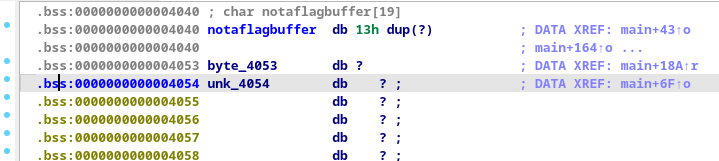

# The Wall
The Wall had an attachment, a 64-bit ELF file named `null_wall` (it will be useful later lol). Once decompiled, it provided approximately this result:

Once decompiled, we looked at how the variables were arranged and noticed that the flag was located 20 bytes after our input pointer, preceded by a `null` byte. This null byte prevented the flag from being printed if fewer than 19 bytes were written. However, once exactly 19 bytes (`0x13 bytes`) were written, the flag was leaked.

### Challenge Description
> A friend of mine told me about a peculiar bank. You gotta give it a try for me.