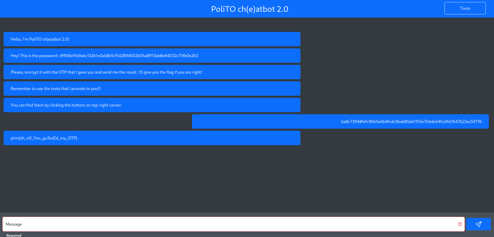

# PoliTOcheatbot 2.0
In this challenge, the objective is to encrypt a password using an OTP (One-Time Pad) unknown to us. After several attempts, we noticed that the tool encrypted any plaintext we sent and sent us back the XOR between the plaintext and a key like `xxxxxxxxxxxxxxxxxxxxxxxxxxxxxxxx` (where obviously x stands for a printable ASCII character).
After several other attempts, we observed that if initially the key was `aaaaaaaaaaaaaaaaaaaaaaaaaaaaaaaa`, in the subsequent encryption it became `bbbbbbbbbbbbbbbbbbbbbbbbbbbbbbbb`.
Having made this observation, it was enough for us to calculate the key once to compute the next one and encrypt the password accordingly.
Once the encrypted password was sent, we obtained the flag as expected.

### Challenge Description
> I've improved my encryption system you won't be able to break it this time!