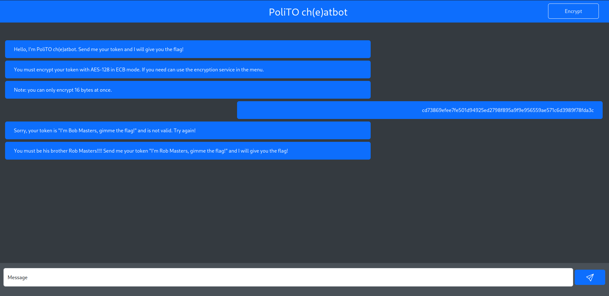

# PoliTO Ch(e)atbot
After a brief study of the challenge website, the objective became clear: encrypt the token `I'm Bob Masters, gimme the flag!` using the available __AES-128 ECB tool__. 

Initially, attempts were made to split the token into two 16-byte blocks and encrypt them separately. However, this approach failed because the webpage blacklisted the second block as it was. Through experimentation, it was observed that `'a' * 16` encrypted was the same as `'a' * 16 + 'b'`. This indicated that the tool was only encrypting the first 16 bytes of the inserted plaintext.

Following this observation, to bypass the control, it was sufficient to write the second block concatenated with some random text. This action resulted in the encryption of the second block and consequently revealed the flag.

### Challenge Description
> All my messages are encrypted with my secret key, will you be able to communicate with me?