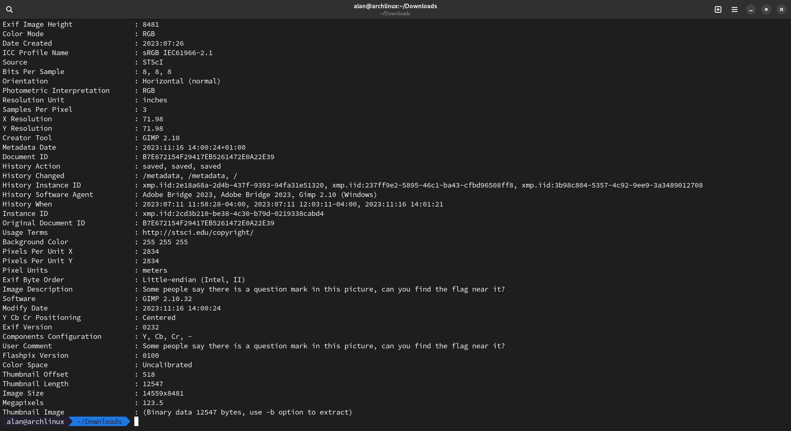

# A sky full of 5t4r5
This time, the challenge contained an image (frighteningly heavy, about `211 MB`) that resembled this screenshot: 

Once analyzed with ExifTool, it gave this result from which one can obviously notice the comment in the metadata of the photo which is `Some people say there is a question mark in this picture, can you find the flag near it?`

At this point, it was just a matter of looking around the photo for a while for a question mark (bottom right) to actually find the flag.

### Challenge Description
> Deep space photos are amazing!
