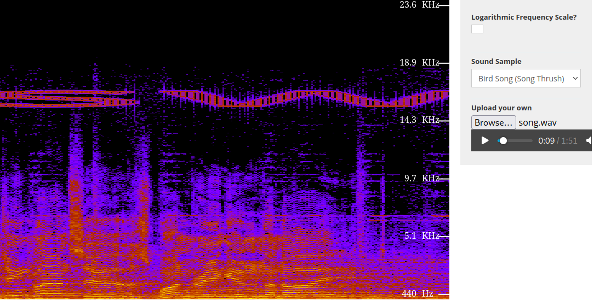

# Strangers in the Noise
"Strangers in the Noise" contained the famous Frank Sinatra song "Stranger in the Night". While analyzing it, we didn't find much until we used this website and managed to notice letters in the spectrum of the song as it progressed. Once we obtained the entire flag still encrypted as `swp{v0p3wk1qj_1q_b0xu_h4u5_z4v_vr_4qq0b1qj}`, all we had to do was use a __Caesar cipher decoder__ to obtain the final flag.

Here you can see the first part of the flag `sw`.

### Challenge Description
> My friend is an ancient tunes collector. Yesterday he found this old gem but it doesn't sound quite right. Can you help him find what's wrong?