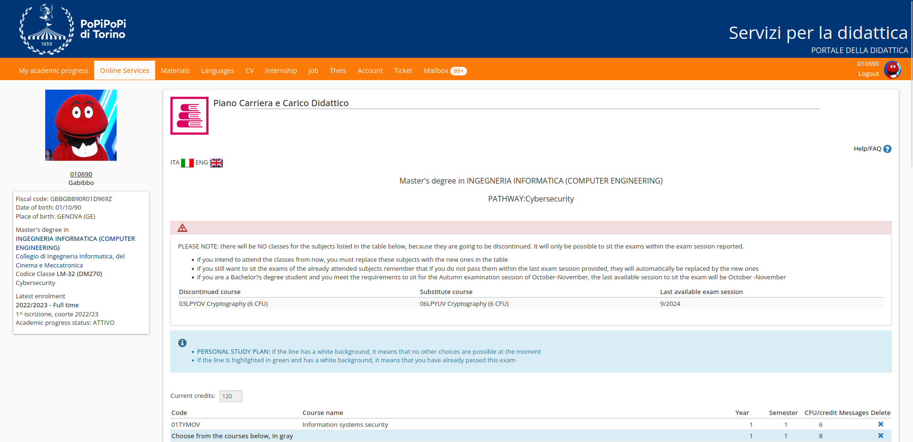

# Piano Carriera
For those who participated in the `m0lecon CTF beginner 2021` and remembered the Exam Booking challenge, they might recall the scenario where the user had to register for an exam when all available spots were already taken.

In a similar way, this problem involves bypassing a client-side check that blocks the registration request. Once all the required data is obtained, the only thing left to do is to call the API to register and obtain the flag. The necessary parameters for this are `cod_ins` (20FWYOV), `cod_ins_padre` (29EBHOV), and `id_padre` (244355).

### Challenge Description
> Gabibbo's got a dream in his eyes - to intern at Mediaset! But his piano carriera seems to be playing the wrong notes. 🎹 Can you help him add the course `Internship` through the portal?