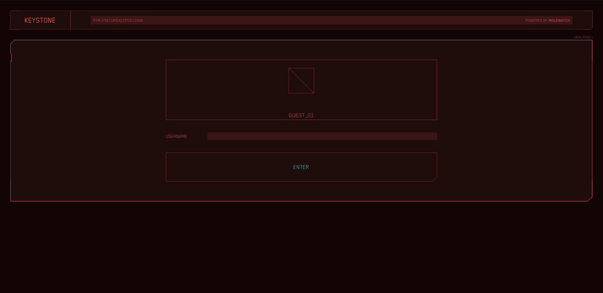

# Secure Access
The challenge had an attachment, a Python bytecode file (.pyc), which once decompiled, resulted in this function:
```python
def generate_token(nonce: str):
    username = 'user001'
    secret = hashlib.sha256(username.encode() + nonce.encode()).hexdigest()
    bundle = {'user':username, 'secret':secret}
    return base64.b64encode(json.dumps(bundle).encode())
```

The challenge required an username (obviously `admin`) and an access token that could be calculated using a nonce provided to the endpoint `/stage2?username=admin`. Once the token was calculated using the previously mentioned function, all that was needed to obtain the flag was to send the token and automatically gain access to the admin panel.



### Challenge Description
>Alright choom we've got a gig for you.
Our best netrunners managed to leak a fragment of code from an authentication daemon.
Seems it was built using AIs from beyond the blackwall, out of reach from anyone except the best.
Will ya be able to log in as admin?